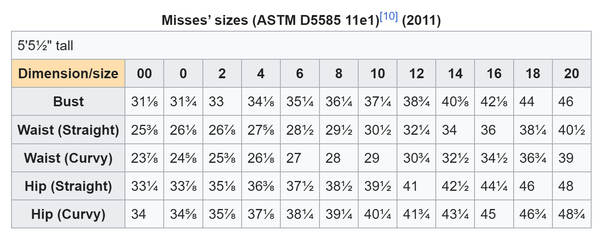
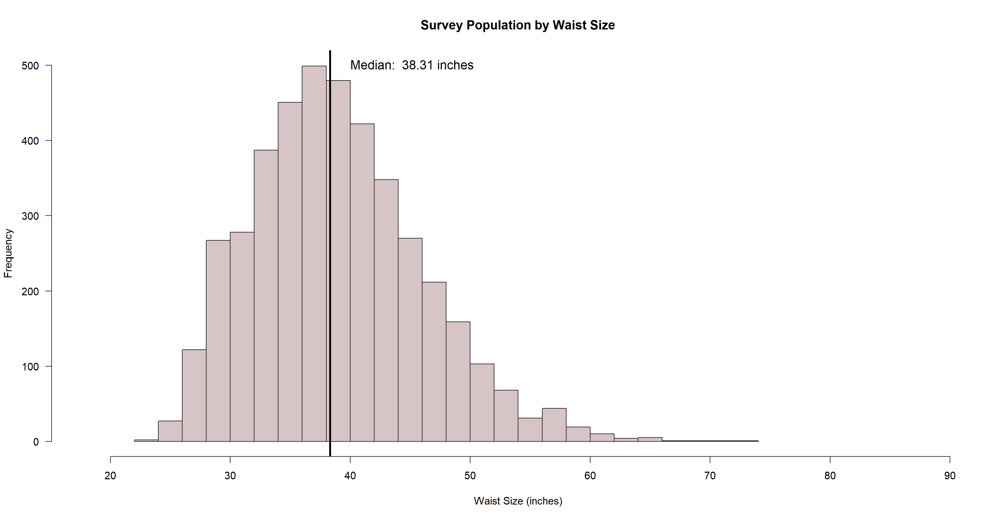
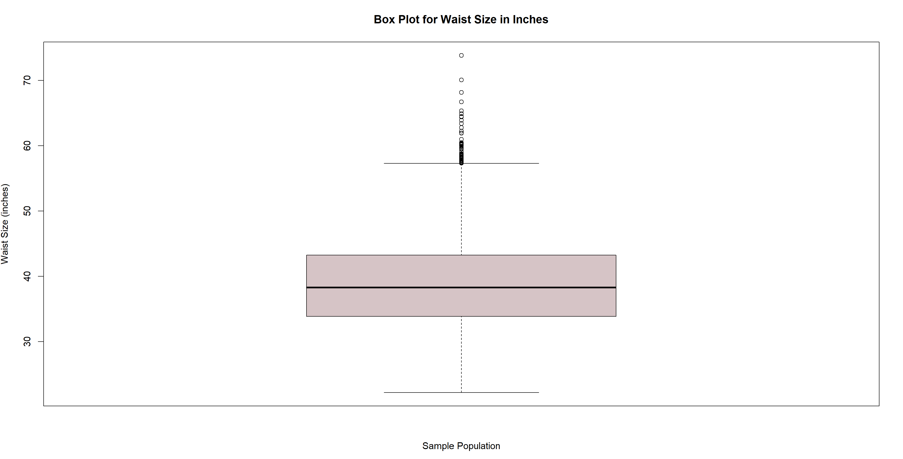
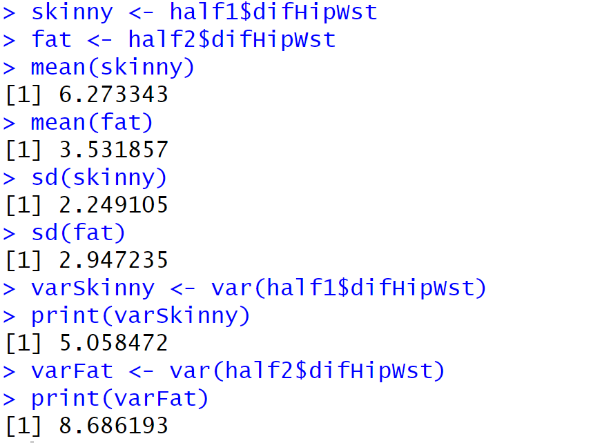
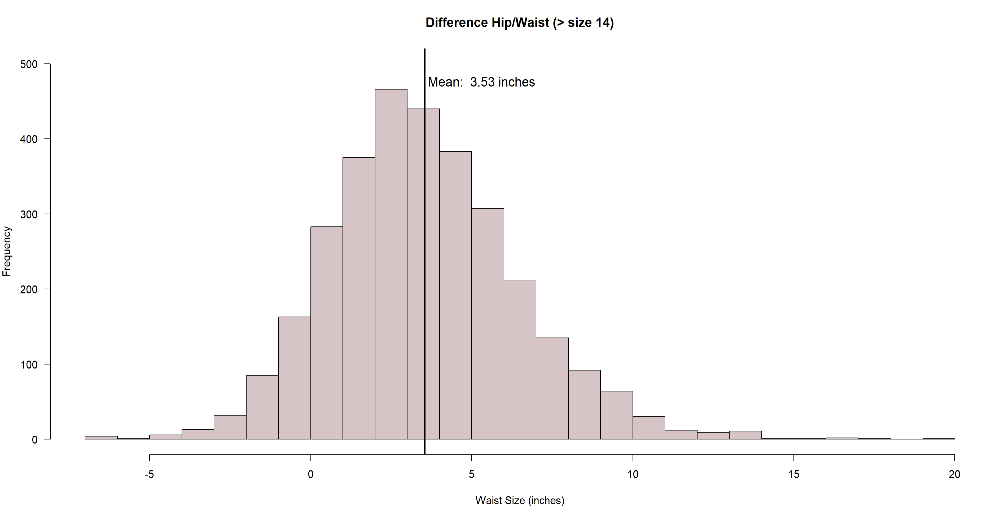
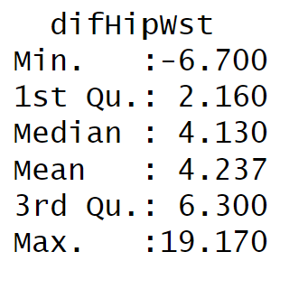
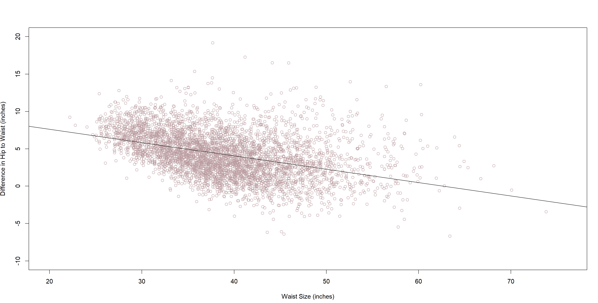

[](https://classroom.github.com/a/PhQBpOAT)
# Reconceiving Fashion's Standardized Sizing to Include Plus Size

The global fashion industry is valued at $1.7 trillion dollars as of 2023[1]. However, only 8% of industry brands cater to the plus size market [2]. Currently, it is estimated that the demand for plus size clothing is valued at $352.5 million and it is expected to reach $685.87 million by 2030[3]. Sales for plus size clothing grew 18% in 2021 which is three times faster than the rest of the women's market [4] One retailer, ModCloth, saw business more than triple when they expanded to full-figured apparel in 2011 with plus-size items having a 25% higher order value than the average order [5]. So why are there not more retailers branching into offering extended sizes? Why is only 19% of the women's clothing being produced offered in plus sizes? Why does this major disconnect exist if 67% of American Shoppers are a size 14 or above which is considered "plus-size" by fashion industry standards [6]? 

An interview with a fashion industry expert reveals that current industry standards for woman's sizing is based on 1950s standards and typically extend to a size 12 or 14 at the most. Beyond that, the variations in body dimensions vary so greatly that it is hard for a company to create a standard fit. Second, manufacturing plus size clothing is more difficult as current machines and fabric are already designed or set at certain lengths and widths. Last, there is a industry myth that plus size people do not care about outward appearance nor have money to spend on clothing. 

Historical research shows that the first attempt to standardize sizing in the US started in 1940. Two statisticians Ruth O'Brien and William Shelton, received a Works Progress Administration grant to conduct the most ambitious effort to measure almost 15,000 women across the US. Their discoveries lead to over 27 different sizes with 5-7 different body shapes and a three-part sizing system. This would have been a manufacturing nightmare and was impractical. Additionally, the data may have been flawed as only white women were measured and a stipend was offered and it is assumed only the poor and malnourished were measured [8]. Almost ten years later, The National Bureau of Standards (NBS), invented a new sizing system based on the hourglass figure and using only the bust size to create an arbitrary standard of sizes ranging from 8 to 38 [7]. Currently, only 8% of the population has the hourglass body shape. The NBS data was based on the work of O'Brien and Shelton, and they further distorted the results by adding the measurements of the women who served in the army during WWII; some of the most fit women in the population [8]. The resulting commercial standard was not widely popular and was declared voluntary in 1970.  

The most recent attempt to standardize sizing was a project called SizeUSA and was conducted by a private organization called the Textile Clothing Technology Corporation.  They installed body scanners at 13 different locations across the country and, over the course of about a month, scanned the bodies of almost 11,000 people between the ages of 18 and 80 in the early 2000s. The main finding, says Lynn Boorady, who was involved with the study, is that people are bigger than ever and that the hourglass shape is not the standard body shape for all women[8]. There are too many permutations of the female body to create a standard size system. Boorady drove this point home when she described her analysis of the SizeUSA data: In trying to find an average hip girth for a 28-inch waist, she discovered a 12-inch spread. If you were to create one pattern for a 28-inch waist, you would no doubt leave out most women [8].

## Statement of Scope
The scope of this project is to defend the need to design and manufacture more plus size clothing. This project will also address the current catastrophe of the current standardized sizing as it relates to plus sizes and suggest possible changes to create more accurate sizing guidelines. 

This dataset looks at the body measurements of individual US women over the age of 18. Body measurements including waist and hip circumference are assessed and compared to gain insights in sizing. The goal is to determine average body shapes of US women to better predict standardized sizing for fashion design. Pregnancy can be considered niche and would morph the body shape measurements and therefore will be excluded from the dataset. Body measurements including waist and hip circumference are assessed and 

The main supporting questions to be answered are:

    1. What is the average size of an American woman and is there merit in adding plus sizes to standardized sizing? Does the data support the necessity of designing and manufacturing clothing larger than a size 14? 

    2. How diverse is the shape of American women and is there any truth to the statement that bigger sizes equal bigger variation?
    
    3. Is the industry standard to simply scale up model fit sizes appropriate to apply to larger sizes? Is there a better method for designing a better fit?

## Data Preparation
For this project all data was obtained from the National Health and Nutrition Examination Survey. A demographic dataset and a body measurement dataset were combined to create a dataset with 14,300 participants. This dataset was obtained from participants that were measured from 2017 to March 2020. The data was then reduced to only include females over the age of 18 and anyone who was pregnant was removed. Data was then checked for complete cases and only participants with all body measures or demographic data were kept. The final dataset consists of 4,212 participants. 

* [Plus Size Data](code/plus_size_anthro_data.R ) R file used to merge P_DEMO.XPT and P_BMX.XPT, clean data, and run all the analysis and models.

### Data Access
The National Health and Nutrition Examination Survey (NHANES) is a national survey that monitors the health and nutritional status of adults and children across the United States. The survey is unique in that it combines interviews and physical examinations. NHANES is run by the National Center for Health Statistics (NCHS) and is part of the Centers for Disease Control and Prevention (CDC). The NHANES survey includes demographic statistics as well as body measurement statistics dating back to 1999. These data are available to the public.  

This project used the most recent sampling cycle available which was the NHANES 2017-March 2020 pre-pandemic data. The NHANES program suspended field operations in March 2020 due to the coronavirus disease 2019 (COVID-19) pandemic. As a result, data collection for the NHANES 2019-2020 cycle was not completed and the collected data are not nationally representative. Therefore, data collected from 2019 to March 2020 were combined with data from the NHANES 2017-2018 cycle to form a nationally representative sample of NHANES 2017-March 2020 pre-pandemic data. 

Two data sources were pulled from the NHANES website pertaining to the demographic data of the survey participants and the body measurement data. These two datasets were linked by a unique identifier given to each participant.  

* [P_DEMO.XPT](data/P_DEMO.XPT) The demographic dataset obtained from the NHANES 2017- March 2020 pre-pandemic data.
* [P_BMX.XPT](data/P_BMX.XPT) The body measurement dataset obtained from the NHANES 2017- March 2020 pre-pandemic data.

### Data Cleaning
The original two data sets had a total of 50 variables that included demographic and body measurement data. These tables were reduced to 17 variables of interest including age, gender, ethnicity, income level, and body measurements such as height, weight, waist size, and hip size. The final dataset includes 14,300 participants.

The data were then filtered to only include female participants which minimized the dataset to 7,215. The dataset was further reduced to only include persons over the age of 18, leaving 4,608 participants. 

If any participants were pregnant, they were also removed as their body shape and waist size would vary and are not part of the scope of this project. For the participants that were listed as "unsure" if they were pregnant and coded as a "3", meaning their pregnancy test was negative, were left in the dataset as their body shape could be assumed to be the same as if they were not pregnant. 

After applying all of the filters, 4,521 participants remained. The following is the R code used to filter the data:

```R 
variables.of.interest %>% 
  select(RIDAGEYR, RIAGENDR, BMXWT, BMXHT, BMXWAIST, BMXHIP, RIDEXPRG) %>% 
  filter(RIAGENDR == 2) %>% 
  filter(RIDAGEYR >=18)%>% 
  filter(data_wo_preg <-RIDEXPRG %in% c(2,3,NA))
```


### Data Transformation
Appropriate data types were assigned to each variable. Variables with decimals or exact measurements were left as the numeric class, dbl. The ethnicities groups were assigned the factor class. Gender and age were assigned as integers as well as any comments that had numbers assigned to each comment. 

Columns were added for variables that were original listed as cm or kg and converted to in or lbs respectively. 

The NAs found in the pregnancy data indicated that the participant was not pregant therefore this information was transformed so that it could be maintained when filtering for complete cases. All NAs in this column were mutated to a code of "4". The following R code was used:

```R 
variables.of.interest %>% 
   mutate(RIDEXPRG = replace_na(RIDEXPRG, 4))
   filter(complete.cases(.))
```

The merged data had 50 variables and this data was reduced to 17 varibles that pertain only to demographics such as gender, age, income, ethnicity and location. The body measurement variables were reduced to height, weight, waist circumference, hip circumference, and BMI and any variables that contained notes or comments for these previously listed variables. 

There is a consideration to only use "complete cases", meaning all data is present for all body measurements. If a filter is set to only keep complete cases, the final participant count is 4,212. This is the final dataset however, in certain cases, when data isn't dependent of each other, there is a possibility to open the dataset back up and look at each variable independently and keep the data even though the other variables might be missing. 

### Data Consolidation
There were two main data files obtained directly from www.cdc.gov/nchs/nhanes/index.htm; The body measurement data, P_BMX.XPT and the participant's demographic data, P_DEMO.XPT from 2017 to March 2020. These data were combined to create one data frame called mergeddata.

### Data Dictionary
The following table outlines the variables used in the merged dataset: 

| Attribute Name | Description | Data Type | Source | Data | Example |
|:---|:---|:---:|:---|:---|:---:|
| SEQN | Respondent Sequence Number | Numeric | [CDC NHANES Website](https://wwwn.cdc.gov/nchs/nhanes/continuousnhanes/default.aspx?Cycle=2017-2020) | [P_DEMO.XPT](P_DEMO.XPT) and [P_BMX.XPT](P_BMX.XPT)| 109263 |
| RIAGENDR | Gender | Integer | [CDC NHANES Website](https://wwwn.cdc.gov/nchs/nhanes/continuousnhanes/default.aspx?Cycle=2017-2020) | [P_DEMO.XPT](P_DEMO.XPT) | 1 = male, 2 = female |
| RIDAGEYR | Age in years, at the time of the screening interview, is reported for survey participants between the ages of 1 and 79 years of age. | Integer | [CDC NHANES Website](https://wwwn.cdc.gov/nchs/nhanes/continuousnhanes/default.aspx?Cycle=2017-2020) | [P_DEMO.XPT](P_DEMO.XPT) | 22 |
| RIDRETH3 | Race-ethnicity Respondents who self-identified | Factor | [CDC NHANES Website](https://wwwn.cdc.gov/nchs/nhanes/continuousnhanes/default.aspx?Cycle=2017-2020) | [P_DEMO.XPT](P_DEMO.XPT) | 1 = "Mexican American", 2 = "Hispanic", 3 = "non-Hispanic white", 4 = "non-Hispanic black", 6 = "non-Hispanic Asian", 7 = "non-Hispanic multiracial". Code "5" was not used in RIDRETH3 |
| RIDEXPRG | This is the pregnancy variable | Integer | [CDC NHANES Website](https://wwwn.cdc.gov/nchs/nhanes/continuousnhanes/default.aspx?Cycle=2017-2020) | [P_DEMO.XPT](P_DEMO.XPT) | 1 = Pregnant, 2 = Not pregnant, 3 = cannot be determined, 4 (NA) = Not Pregnant |
| INDFMPIR | This variable is the ratio of family income to poverty. | Numeric | [CDC NHANES Website](https://wwwn.cdc.gov/nchs/nhanes/continuousnhanes/default.aspx?Cycle=2017-2020) | [P_DEMO.XPT](P_DEMO.XPT) | 3.06 |
| BMXWT | Weight (kg) | Numeric | [CDC NHANES Website](https://wwwn.cdc.gov/nchs/nhanes/continuousnhanes/default.aspx?Cycle=2017-2020) | [P_BMX.XPT](P_BMX.XPT) |42.8 |
| BMIWT | Weight Comment | Integer | [CDC NHANES Website](https://wwwn.cdc.gov/nchs/nhanes/continuousnhanes/default.aspx?Cycle=2017-2020) | [P_BMX.XPT](P_BMX.XPT) | 1 = Could not obtain, 3 = Clothing, 4 = Medical Appliance |
| BMXHT | Height (cm) | Numeric | [CDC NHANES Website](https://wwwn.cdc.gov/nchs/nhanes/continuousnhanes/default.aspx?Cycle=2017-2020) | [P_BMX.XPT](P_BMX.XPT) | 196.2 |
| BMIHT | Height Comment | Integer | [CDC NHANES Website](https://wwwn.cdc.gov/nchs/nhanes/continuousnhanes/default.aspx?Cycle=2017-2020) |[P_BMX.XPT](P_BMX.XPT)| 1 = Could not obtain, 3 = Not straight |
| BMXBMI | Body Mass Index (kg/m²) | Numeric | [CDC NHANES Website](https://wwwn.cdc.gov/nchs/nhanes/continuousnhanes/default.aspx?Cycle=2017-2020) | [P_BMX.XPT](P_BMX.XPT) | 24.8 |
| BMXWAIST | Waist Circumference (cm) | Numeric | [CDC NHANES Website](https://wwwn.cdc.gov/nchs/nhanes/continuousnhanes/default.aspx?Cycle=2017-2020) | [P_BMX.XPT](P_BMX.XPT) | 91.4 |
| BMIWAIST | Waist Circumference comments | Integer | [CDC NHANES Website](https://wwwn.cdc.gov/nchs/nhanes/continuousnhanes/default.aspx?Cycle=2017-2020) | [P_BMX.XPT](P_BMX.XPT) | 1 = could not obtain |
| BMXHIP | Hip Circumference (cm) | Numeric | [CDC NHANES Website](https://wwwn.cdc.gov/nchs/nhanes/continuousnhanes/default.aspx?Cycle=2017-2020) | [P_BMX.XPT](P_BMX.XPT) | 126.1 |
| BMIHIP | Hip Circumference comments | Integer | [CDC NHANES Website](https://wwwn.cdc.gov/nchs/nhanes/continuousnhanes/default.aspx?Cycle=2017-2020) | [P_BMX.XPT](P_BMX.XPT) | - |


In the table below, each variable is listed with a brief description of what it along with an explanation of how it might be used in the analysis. 


| Attribute Name | Purpose | 
|:---|:---|
| SEQN  | Unique identifier for participants in the NHANES survey. It is present in all datasets and links datasets together. It will be used to link demographic and body measurement data together. |
| RIAGENDR | Gender. This will be used to filter the data down to females only. |
| RIDAGEYR | The age of the survey participant will be used to filter out children and teenagers. |
| RIDRETH3| This is the race identifier that may be used to used to determine different body types amoungst different races. |
| RIDEXPRG  | This denotes if a participant is expecting or not. It is used to filter out pregnant participants. |
| INDFMPIR | The income to poverty ratio. Could be used to determine correlate body size to spending potential. |
| BMXWT  | Weight of the Participant in Kg. and may be used to determine correlations in the data.  |
| BMIWT | Comments relating to the collection of the weight of the participant. Maybe used in cleaning the data or removal of outliers |
| BMXHT | Height of the Participant in cm. and may be used to determine correlations in the data. |
| BMIHT | Comments relating to the collection of height of the participant. Maybe used in cleaning the data or removal of outliers |
| BMXBMI | Body Mass Index (kg/m²) and may be used to determine correlations in the data.
 BMXWAIST | Waist Circumference of the participant in cm. and may be used to determine correlations in the data. | 
 | BMIWAIST | Comments relating to the collection of the waist circumference of the participant. Maybe used in cleaning the data or removal of outliers |
 | BMXHIP | Hip Circumference of the participant in cm. and may be used to determine correlations in the data. |
 | BMIHIP | Comments relating to the collection of the waist circumference of the participant. Maybe used in cleaning the data or removal of outliers  |


## Visualizations and Modeling

### Average Population Waist Size

The assumption is that plus size fashion is a niche market that only serves a small proportion of the population. Since this dataset is intended to represent the entire population of the United States, let's take a look at the descriptive statistics of the survey population and see if this assumption holds true. 

Although sizing varies greatly among fashion brands, multiple sources site a size 12 or 14 as the typical max size available in standard stores. For this comparison a size 14 will be considered the average max size readily available. Along with varying sizing options, the actual body measurements that correlate with the marked size of each fashion brand varies greatly significantly as well. This study will use the ASTM standards sited on Wikipedia as the measurement of comparison.  For a women's size 14, the listed waist size is 34 inches for a straight cut. Straight cut is the more prominent cut compared to curvey, and it is the default cut if multiple cuts are not offered, therefore the decision is to use the straight sizing for the comparison. 



As mentioned in the introduction, bust size is typically used as the base measurement to set clothing sizes. Since the NHANES dataset does not contain bust size as a variable, waist size will be used as the comparison variable. Basic descriptive statistics are run on the waist size, in inches, for the survey population of 4212 participants and the resulting values are listed below:


| Min | 1st Qu | Median | Median | 3rd Qu | Max |
|:---|:---|:---:|:---|:---|:---:|
| 22.20 | 33.86| 38.31| 38.92 | 43.23 | 73.82


The sample population has a mean waist size of 38.92, compare that to the waist size of the ASTM listed standard of 34 inches for the max size of clothing at most stores. The median of the dataset lands slightly lower at 38.31 inches, which still compares to the ASTM size 18 and is well over the max size 14 typically offered. Why is this happening? Why are a majority of clothing stores only offering clothing options for less than half of the population?

A histogram is created to visually demonstrate the frequency of the waist size for the dataset population. A line is drawn to show the halfway mark for the dataset. Fifty percent of the sample population has a waist size smaller than 38.31 the other half has a waist size larger than 38.31 inches. 



Looking at the distribution of this histogram, the data is moderately skewed right, with a skewness result of 0.57. This depicts a dataset with a longer tail to the right and the bulk of the values are concentrated on the left. The kurtosis value, 3.38, comes in close to a normal distribution of 3, however it is slightly leptokurtic and has longer tails and a more peaked distribution. What this means for clothing production is that capturing the sizes to facilitate everyone on the "larger" side, or right hand side of the distribution, would require designing and producing more sizes, which would require larger capital and more risk. 

In order to take a deeper look into the longer tail to the right, a box plot is created. This box plot appears to be fairly symmetrical with the median appearing to sit fairly close to the middle of the inner quartile range. The upper whiskey is slightly longer than the lower whisker. There are several potential outliers outside of the upper limit that may need to be handled to help normalize the dataset. 




The following R code was used to complete the calculations for the inner quartile ranges as well as the upper and lower limits:

```R 
Q1 <- quantile(finalDataset$BMXWAIST_in, 0.25, type=2)
Q3 <- quantile(finalDataset$BMXWAIST_in, 0.75, type=2)

IQR <- (Q3 - Q1)

lower_limit <- Q1 - 1.5 * IQR 
print(lower_limit)
upper_limit <- Q3 + 1.5 * IQR
print(upper_limit)
outliers <- finalDataset[finalDataset$BMXWAIST_in < lower_limit | finalDataset$BMXWAIST_in > upper_limit,]
print(outliers)
count(outliers)
```

Here are the results percentile and inner quartile range calculations:

| Quantile 25% | Quantile 75% | Lower Limit | Uper Limit | Count of Outliers |
|:---|:---|:---:|:---|:---:|
| 33.86 | 43.23| 19.81 | 57.29 | 55 |

The inner quartile range is 9.37 inches. The 25 percentile is 33.86 inches and the 75 percentile 43.23 inches. This means that 50% of the sample population has a waist size between 33.86 and 43.23 inches. This means that potentially half of the population is between a size 12 and a size 22. This begs the question as to why a majority of the clothing produced is a size 10? Continuing on, We take a look at the upper and lower limits. The lower limit, at 1.5 times the inner quartile range, is 19.81 inches and the upper limit is 57.29 inches. If we look for values outside of these ranges, we find that out of a dataset of 4212, there are only 55 values above the upper limit and 0 participants with waist sizes below the lower limit. 

Finally, to grasp the major theme of this section, the waist measurement for a typical size 14, at 34 inches, is compared to the dataset. The following R code was used to find the percentile at which a 34 inch waist size falls:

```R 
value <- 34
half <- finalDataset$BMXWAIST_in

# Use ecdf to create the cumulative distribution function
ecdf_function <- ecdf(half)

# Use the ecdf function to find the percentile
percentile <- round(ecdf_function(value) * 100, 2)

# Print the result
print(paste("The value", value, "is at the", percentile, "th percentile."))
```

The above code produces the following result: "The Value 34 is at the 25.71th percentile".

So, under the aforementioned assumptions, most clothing companies make clothing up to a max size of 14, and that the average size 14 has a waist size of 34 inches, almost 75% of the population is being excluded in the ability to purchase clothing that fits.

In summary, the sample population used as a representation of the US population highlights the necessity of producing larger sizes to accommodate the prevailing waist measurements of women in the United States. Consideration was given as to leave in the potential outliers or remove them and it was decided that since these were real measurements, from real people which represent the US population, they were left in. 

## Hourglass Shape Variation

Transitioning from the previous discovery, where it was found that a significant proportion of the population falls above a size 14 or larger, a major question is promted: If over half the population is larger than a size 14, why are fashion companies not producing plus size clothes?  Is it true that plus sizes exhibit more variability compared to standard sizes, making their production more challenging? 

The data was split into two datasets using the following R code:

```R 
# Choose the splitting threshold (e.g., median or number)
Split_Data <- data.frame(finalDataset)
split_threshold <- 34

# Use dplyr to split the dataset
half1 <- subset(Split_Data, finalDataset$BMXWAIST_in <= split_threshold)
half2 <- subset(Split_Data, finalDataset$BMXWAIST_in > split_threshold)

# Print the results
print("First Half:")
summary(half1)

print("Second Half:")
summary(half2)
```

The dataset that had a waist size below 34 inches, or a size 14, was called the "skinny" dataset and it resulted in 1083 participants that fit this skinny portion of the people. The second set was called the "fat" dataset, and it included 3129 participants that are over a size 14 waist size. The follow output for the summary stats was given:



The mean for the skinny people is a 6.7 inch difference in their hip to waist measurements whereas the larger people have a smaller difference of 3.53. The standard deviations are closer together at 2.25 for the skinny dataset and 2.95 for the fat dataset. The variance of the skinny dataset is 5.06 inches, and the fat dataset has a much larger variance of 8.69 inches. This does show that there is greater variance as the waist size increases, which would lead to larger production costs.

Comparing the histograms between the two datasets we can see that the skinnier participants have a greater mean of 6.27 inches compared to the fat dataset with a mean of 3.53 inches. Simply, this means that the participants smaller than a size 14 have a difference in hip-to-waist size of 6.27 inches and the participants over a size 14 average a 3.53 inch hip-to-waist difference.

The skinny dataset has a much lower skewness (0.02) compared to the full dataset which had a skewness of 3.38. This data is extremely close to 0 for the skewness and is therefore extremely close to being a perfectly normal distribution. The kurtosis at 2.94 is again, also extremely close to a normal value of 3.0. 

#### Skinny Histogram


The fat dataset is still slightly skewed right at a value of 0.46, due to those possible outliers, and the kurtosis is now higher at 3.95 meaning it is higher peaked with longer tails compared to full dataset. Comparing the standard deviations, the variances, and the histograms of the split datasets, we can validate the statement that sizing varies more as clothing sizes grow. 

#### Fat Histogram


### Scaling the Sizes

Moving forward, consider the fashion industry standard where the perfect model has a body shape with a difference of 10 inches in their hip to waist measurement. Is is appropriate to assume this for all waist sizes and just scale the hip size accordingly as waist size grows? A calculation is conducted on the sample population that subtracts the waist size from the hip size to get the difference between the two measurements. Statistics were then run on the difference in hip to waist measurements to see how they compare to the industry standard requiring a smaller waist compared to hips.



Across the entire dataset, the average difference in hip to waist measurements is 4.24 inches. This means that the average person has a roughly 4 inch smaller waist compared to fashion models with a 10 inch smaller waist compared to their hips. From the minimum value of -6.70 we can tell that at least one person has hips that are smaller than their waist by 6.7 inches and there is at least one Kardashian that has a difference of 19.17 inches from their waist to hips. 

To take this analysis one step further, the following code was run in R to find out what percentile the coveted 10-inch difference in hips to waist measures sits at. 

```R 
value <- 10
diffPercent<- finalDataset$difHipWst

ecdf_function <- ecdf(diffPercent)

percentile <- round(ecdf_function(value) * 100, 2)

print(paste("The value", value, "is at the", percentile, "th percentile."))

```
The output shows that 97% of the population does not have a difference larger than 10 inches between their waist and hips. So is there a correlation between waist size and that relative size of hips? Could manufactures predict a better hip to waist ratio as waist size grows?  

Finally, a plot is created to compare the difference in hip to waist size as waist size increases. The units for both axis are in inches. The data appears to follow a linear decline where the increase in waist size equates to a decrease in hip to waist difference. This means that as waist size increases, the tendacy towards the hour-glass body shape decreases. 



The output summary for the plot above describes a highly significant correlation between the difference in hip/waist size on waist size with a p-value of 2e-16. So, if a hypothesis test was conducted stating that the null hypothesis is that there is no effect on hip/waist size based on waist size, we would reject the null and say that there is an effect. 

It is calculated that for every inch increase in waist size, the hip/waist difference decreases by 0.18 inches. The R-squared stat depicts that roughly 17% of the variation on hip to waist size difference can be attributed to waist size. The F-stat is very large at 871.1 and tells us that this conclude that the regression model does significantly explain more than what the error term does.

If the fashion industry moved towards using statistical calculations to create sizing standards verses using the current practice of simplying scaling up a "model fit" of a 10-inch waist difference, there may be more purchases of plus size clothes as the fit would be better. 

## Conclusion and Discussion
The analysis conducted on the dataset derived from the NHANES data aimed to shed light on the standardized sizing practices in the fashion industry, particularly in relation to plus-size clothing. The data concludes that standardized-sizing and fashion manufacturing is exceedingly biased towards sizes 14 and smaller, whereas the NHANES data indicates otherwise. The data revealed that approximately 75% of the population falls above the size 14 waist, emphasizing the need for expanded sizing options to accommodate a more diverse range of body sizes. From a business perspective, only 25% of the nation's consumers are being represented which leaves 75% of the possible profits left out to the wind. 

The analysis did confirm that as waist size increases, there is greater variability in the hip-to-waist difference. This variability poses challenges for standardized sizing, as the one-size-fits-all approach becomes less applicable, leading to potential production complexities and increased costs.

Finally, the data challenged the idea that the best model fit is a 10 inch difference in hip-to-waist measurements and clothing should be scaled up this way. Even current standard sizes are not represented by a 10 inch hip-to-waist difference and 97% of the sample population has a difference smaller than this. This demonstrates that the sizing practice based on using model fits and scaling up is nonsensicle and obsolete. 

I would be interested to see if the outliers were removed from the upper end of the dataset if the hip-to-waist ratio would vary as much. It would be valuable to rerun all the models with updated data excluding outliers. I would also run multiple regression including other variables such as height, weight, income, etc. Another goal I have is to bin the data by waist size that correlates to new purposed dress sizes and see if a model can predict a better body shape calculation for measurements such as hip-to-waist for each dress size. 

The current standardized sizing norms need a major overhaul, and the fashion industry needs to reconsider its approach to sizing and inclusivity. By acknowledging and embracing the diversity of body shapes, businesses could tap into a significant market demand for plus-size clothing, potentially leading to increased sales and customer satisfaction. Exploring innovative technologies, such as 3D body scanning, could aid in creating personalized sizing solutions for a more diverse customer base.